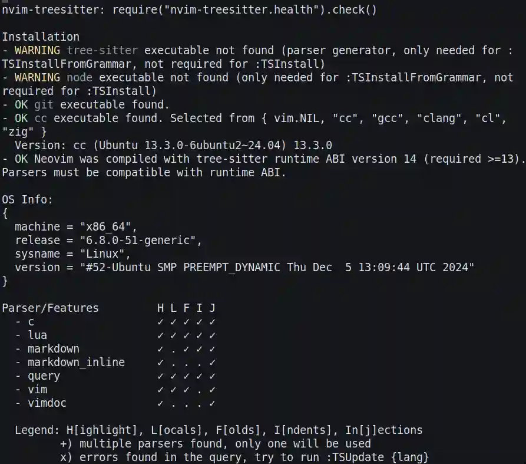
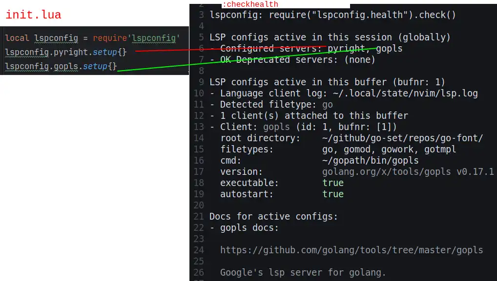
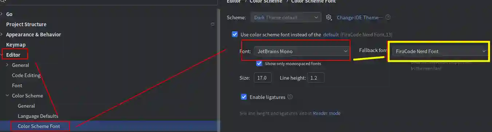

# Version

```
NVIM v0.10.2
Build type: RelWithDebInfo
LuaJIT 2.1.1713484068
```

# INSTALL

```sh
mkdir -p ~/.config/nvim
git clone https://github.com/CarsonSlovoka/nvim.git ~/.config/nvim
cd ~/.config/nvim
git submodule update --init --recursive

# 初始化自定義永定書籤
echo 'return {
   { name = "Documents", path = "~/Documents" },
   { name = "Downloads", path = "~/Downloads" },
}' >> ~/.config/nvim/bookmark.lua


# (可選) 安裝Nerd Fonts
wget https://github.com/ryanoasis/nerd-fonts/releases/download/v3.3.0/FiraCode.zip
unzip FiraCode.zip -d ~/.fonts
rm -v *.zip
echo 'font=FiraCodeNerdFontMono-Retina:size=14' >> ~/.config/foot/foot.ini # 設定終端機的字型
}

```

> 如果有需要還要安裝想要的[lsp server](#安裝語言伺服器)


添加doc

```bash
# (可選) tags
:helptags ~/.config/nvim/doc
:helptags ~/.config/nvim/pack/search/start/telescope.nvim/doc/
:helptags ~/.config/nvim/pack/git/start/gitsigns.nvim/doc/
:helptags ~/.config/nvim/pack/tree/start/nvim-tree.lua/doc/
```

# 目錄結構

- ✅ 表示目前已經有實作
- 沒有標記的部份就只是目前規劃

```
~/.config/nvim/
├── init.lua                         -- ✅ 主入口配置文件
├── bookmark.lua                     -- ✅ 自定義永久書籤的內容
├── doc/                             -- ✅ nvim的幫助文檔(可用:help找尋關聯tag)
├── pack/                            -- git rev-parse --short HEAD | wl-copy
│   ├── syntax/start/
│   │          ├── nvim-treesitter/             -- ✅ 語法高亮 (v0.9.3... 096babe)
│   │          └── nvim-treesitter-textobjects  -- ✅ visual下的選取, 移動(function, class), 參數交換 (需要先裝nvim-treesitter以及lsp之後才能有效使用) (ad8f0a47)
│   │
│   ├── lsp/start/                   -- ✅ language server protocol
│   │       │
│   │       └── nvim-lspconfig/      -- ✅ 語言協議(語言伺服器要額外安裝, 每個語言的裝法不同), 配合好該語言的伺服器，即可在編輯完成後，做檢查之類的 (v1.2.0 c580f34)
│   │
│   ├── git/start/                   -- ✅ git
│   │       │
│   │       └── gitsigns.nvim/       -- ✅ 編輯的時候，可以看到git上的異動(新增, 刪除, 修改...) (v1.0.0...  5582fbd)
│   │
│   ├── motion/start/                -- ✅ 移動相關
│   │          ├── hop.nvim          -- ✅ 使用模糊搜尋來快速移動. 熱鍵f, F, t, T (v2.7.2... efe5818)
│   │          └── precongnition.nvim-- ✅ 可以幫助您學習vi,它會提示可以如何移動  (v1.1.0... 531971e)
│   │
│   ├── icon/start/                  -- ✅ 圖標類
│   │        └── nvim-web-devicons   -- ✅ 可豐富nvim-tree的導覽，替其新增圖標 (63f552a) ([github-nvim-theme](#github-nvim-theme)可以輔助)
│   │
│   ├── tree/start/                  -- ✅ 導覧相關
│   │        └── nvim-tree.lua       -- ✅ 左測目錄導覽(還可創建目錄,重新命名,...) (v1.10.0... 7b870f1)
│   │
│   ├── search/start/                -- ✅ 搜尋相關
│   │          └── telescope.nvim    -- ✅ 可以找文件, 搜索文本, 查看大綱(需與lsp配合)... (v0.1.8... 2eca9ba)
│   │
│   ├── theme/start/                 -- ✅ 主題相關
│   │         └── github-nvim-theme  -- ✅ 配色 (v1.1.2... c106c94)`
│   │
│   ├── other/start/                     -- ✅ 未分類
│   │         └── indent-blankline.nvim  -- ✅ 簡稱為ibl 幫你找出括號配對等等 (v3.8.6 259357f)`
│   │
│   └── utils/start/                 -- ✅ 常用函數包裝
│             └── plenary.nvim       -- ✅ require('plenary.path'):new("~/init.lua").{exists(), is_dir())... (v1.1.4... 2d9b0617)
│
├── ftplugin/                        -- ✅ 依據附檔名才會載入的插件
│   │
│   └── markdown/                    -- ✅ markdown編輯, toc相關
│       ├── editor.lua               -- ✅ editor編輯相關
│       ├── markdown.lua             -- ✅ markdown大綱生成 (除非沒有裝telescope才會用這種模式)
│       └── telescope_markdown.lua   -- ✅ 使用telescope生成markdown大綱
│
├── lua/                             -- ✅ Lua 配置模組的根目錄
│   ├── config/                      -- ✅ 基本設定
│   │   ├── telescope_bookmark.lua   -- ✅ 可以加入書籤(導引到該檔案或目錄)
│   │   ├── options.lua              -- ✅ 基本選項 (e.g., 編輯器行為、外觀設定)
│   │   ├── commands.lua             -- ✅ 自定義的命令(:MyCommand, ...)
│   │   ├── keymaps.lua              -- ✅ 鍵位綁定
│   │   ├── autocmds.lua             -- 自動命令 (autocommands)
│   │   └── ...                      -- 其他相關設定
│   ├── ui/                          -- 用戶界面相關配置
│   │   ├── colorscheme.lua          -- 配色方案
│   │   ├── statusline.lua           -- 狀態欄配置
│   │   ├── tabline.lua              -- 標籤欄配置
│   │   └── ...                      -- 其他界面配置
│   ├── lsp/                         -- LSP 配置
│   │   ├── init.lua                 -- LSP 加載邏輯
│   │   ├── servers/                 -- 不同 LSP 伺服器的配置
│   │   │   ├── lua_ls.lua           -- 示例：Lua 語言伺服器
│   │   │   ├── pyright.lua          -- 示例：Python 語言伺服器
│   │   │   └── ...                  -- 其他伺服器配置
│   └── utils/                       -- 實用工具函數
│       ├── exec.lua                 -- ✅ 執行工作相關
│       ├── init.lua                 -- 工具函數的加載
│       ├── mappings.lua             -- 鍵位綁定相關工具
│       └── ...                      -- 其他工具
├── after/                           -- 用於延遲加載的配置
│   ├── ftplugin/                    -- 文件類型相關的配置
│   ├── syntax/                      -- 語法高亮相關配置
│   └── ...                          -- 其他延遲加載配置
└── README.md                        -- ✅ 簡單說明文件
```

# pack

```
:help runtimepath
:help :packadd
    pack/*/start/{name}
```

```bash
for dir in ./pack/*; do du -hs "$dir"; done
```


## nvim-treesitter

```bash
mkdir -p ~/.config/nvim/pack/syntax/start/ # 建立一個syntax的群組
git clone https://github.com/nvim-treesitter/nvim-treesitter.git ~/.config/nvim/pack/syntax/start/nvim-treesitter
```

```yaml
# 此項目是nvim-treesitter所提供的: https://github.com/nvim-treesitter/nvim-treesitter/blob/096babebf6daef2a046650883082ed2b3dcc5b67/lua/nvim-treesitter/health.lua#L117-L174
:checkhealth
```

[](./pack/syntax/start/nvim-treesitter/lua/nvim-treesitter/health.lua)

```yaml
# 更新
:TSUpdate
```


### [nvim-treesitter-textobjects](https://github.com/nvim-treesitter/nvim-treesitter-textobjects)

```bash
git clone https://github.com/nvim-treesitter/nvim-treesitter-textobjects.git ~/.config/nvim/pack/syntax/start/nvim-treesitter-textobjects
```

---

此插件只要裝好就可以了，配置了話，要直接在[nvim-treesitter](#nvim-treesitter)的設定新增`textobjects`再輸入想要的內容即可

```lua
require 'nvim-treesitter.configs'.setup {
    textobjects = {
        select = {
            -- ...
        },
        move = {
            -- ...
        },
        swap = {
            -- ...
        }
    }
}
```

```yaml
:TSUpdate
```

測試用腳本

```go
package main

import (
	"fmt"
)

// Add is a simple function that adds two integers.
func Add(a int, b int) int {
	result := a + b
	return result
}

// Subtract is a simple function that subtracts one integer from another.
func Subtract(a int, b int) int {
	return a - b
}

type Calculator struct {
	Name string
}

// Multiply multiplies two integers.
func (c Calculator) Multiply(a int, b int) int {
	return a * b
}

func main() {
	calculator := Calculator{Name: "Basic Calculator"}
	fmt.Println(calculator.Multiply(3, 4))
}
```

## lsp

1. 下載lsp
2. 安裝語言伺服器
3. 編輯init.lua: `require'lspconfig'.gopls.setup{}`



### 下載lsp(language server protocol)

```bash
## 這個只是protocol, 至於server還是要再另外安裝
mkdir -p ~/.config/nvim/pack/lsp/start
git clone https://github.com/neovim/nvim-lspconfig.git ~/.config/nvim/pack/lsp/start/nvim-lspconfig
```

### 安裝語言伺服器

#### go

```
go install golang.org/x/tools/gopls@latest
which gopls
# $GOPATH/bin/gopls
```

#### python

```bash
pyenv virtualenv 3.13.0 pyright-env
pyenv activate pyright-env
pyenv versions # check switch
python -m pip install --upgrade pip
pip install pyright
pip freeze
# nodeenv==1.9.1
# pyright==1.1.391
# typing_extensions==4.12.2
pyenv deactivate
which pyright | wl-copy
# vim.g.lsp_pyright_path = vim.fn.expand('~/.pyenv/shims/pyright') # 貼上路徑

# 進入nvim之前要啟用虛擬環境, 才會有作用, 而且相關的python套件也要在該虛擬環境有，不然也沒辦法做檢測
pyenv activate pyright-env
nivm ~/test.py
```

建議安裝在全局上，可以省得麻煩
```bash
pyenv install 3.13.0
pyenv global 3.13.0
pip install pyright
pip freeze | grep pyright
# pyright==1.1.391
which pyright | wl-copy
# vim.g.lsp_pyright_path = vim.fn.expand('~/.pyenv/shims/pyright') # 貼上路徑
```

#### [bash-language-server](https://github.com/bash-lsp/bash-language-server)

install from [snap](https://snapcraft.io/install/bash-language-server/ubuntu)

```bash
sudo snap install bash-language-server --classic
snap list | grep bash-language-server
# bash-language-server   4.7.0  69   latest/stable    alexmurray*  classic
```

#### [markdown-oxide](https://github.com/Feel-ix-343/markdown-oxide)

這是用rust寫的項目，如果還沒有安裝rust可以先[安裝](https://rust-lang.github.io/rustup/installation/other.html#other-installation-methods)

安裝好了之後可以得到cargo，就可以透過cargo安裝


**install rust**

```yaml
# curl --proto '=https' --tlsv1.2 -sSf https://sh.rustup.rs | sh -s -- --help
curl --proto '=https' --tlsv1.2 -sSf https://sh.rustup.rs | sh -v
# metadata and tool chains
ls ~/.rustup
ls ~/.cargo
ls ~/.cargo/bin # cargo, cargo-fmt, rustfmt, ...
# ~/.profile # 會自動添加 `. "$HOME/.cargo/env"`
# ~/.bashrc # 會自動添加 `. "$HOME/.cargo/env"`
```

<details>

<summary>sh.rustup.rs的互動訊息</summary>

```
Welcome to Rust!

This will download and install the official compiler for the Rust
programming language, and its package manager, Cargo.

Rustup metadata and toolchains will be installed into the Rustup
home directory, located at:

  ~/.rustup

This can be modified with the RUSTUP_HOME environment variable.

The Cargo home directory is located at:

  ~/.cargo

This can be modified with the CARGO_HOME environment variable.

The cargo, rustc, rustup and other commands will be added to
Cargo's bin directory, located at:

  ~/.cargo/bin

This path will then be added to your PATH environment variable by
modifying the profile files located at:

  ~/.profile
  ~/.bashrc

You can uninstall at any time with rustup self uninstall and
these changes will be reverted.

Current installation options:


   default host triple: x86_64-unknown-linux-gnu
     default toolchain: stable (default)
               profile: default
  modify PATH variable: yes

1) Proceed with standard installation (default - just press enter)
2) Customize installation
3) Cancel installation
```

</details>

> 安裝完成之後，記得重新啟動終端機！

**[install markdown-oxide](https://github.com/Feel-ix-343/markdown-oxide/tree/main?tab=readme-ov-file#vscode)**

```yaml
cargo install --locked --git https://github.com/Feel-ix-343/markdown-oxide.git markdown-oxide
cargo install --list
# markdown-oxide v0.24.0 (https://github.com/Feel-ix-343/markdown-oxide.git#23f4d84f
ls -l $(which markdown-oxide)
# ~/.cargo/bin/markdown-oxide

# cargo uninstall markdown-oxide
```

#### [clangd](https://github.com/clangd/clangd)

```sh
sudo apt install clangd # 113MB
ls -l $(which clangd)
# /usr/bin/clangd -> clangd-18
```

#### [lua-language-server](https://github.com/luals/lua-language-server)

```sh
# 下載並且放到自己想要的目錄
wget https://github.com/LuaLS/lua-language-server/releases/download/3.13.5/lua-language-server-3.13.5-linux-x64.tar.gz
du -hs *.tar.gz
# 3.5M lua-language-server-3.13.5-linux-x64.tar.gz
mkdir -pv ~/lua-language-server/ # 依照個人喜號設定，我是選擇放到家目錄下
mv -v lua-language-server-3.13.5-linux-x64.tar.gz ~/lua-language-server/

# 解壓縮
cd ~/lua-language-server/
tar -xzvf lua-language-server-3.13.5-linux-x64.tar.gz # 於此目錄解壓縮，它不會在有多餘的目錄，直接會把檔案展開於此目錄
rm -v lua-language-server-3.13.5-linux-x64.tar.gz
ls -l ~/lua-language-server/bin/lua-language-server # 此檔案為執行檔

# 連立連結
sudo ln -s ~/lua-language-server/bin/lua-language-server /usr/bin/

# 確認
ls -l /usr/bin/lua-language-server
```

## motion

```bash
mkdir -pv ~/.config/nvim/pack/motion/start/
```

### [precognition](https://github.com/tris203/precognition.nvim.git)

```bash
git clone https://github.com/tris203/precognition.nvim.git ~/.config/nvim/pack/motion/start/precognition.nvim
```

> 插件特色: https://www.youtube.com/watch?v=7hQZhHve4HI


### [hop.nvim](https://github.com/smoka7/hop.nvim)


```bash
git clone https://github.com/smoka7/hop.nvim.git ~/.config/nvim/pack/motion/start/hop.nvim
```

## git

```bash
mkdir -pv ~/.config/nvim/pack/git/start/
```

### [gitsigns.nvim](https://github.com/lewis6991/gitsigns.nvim)

```bash
git clone https://github.com/lewis6991/gitsigns.nvim.git ~/.config/nvim/pack/git/start/gitsigns.nvim
```

## tree

```bash
mkdir -pv ~/.config/nvim/pack/tree/start/
```

### [nvim-tree.lua](https://github.com/nvim-tree/nvim-tree.lua)

```bash
git clone https://github.com/nvim-tree/nvim-tree.lua.git ~/.config/nvim/pack/tree/start/nvim-tree.lua
```

#### 解決亂碼: Nerd Fonts

下載 [Nerd Fonts](https://www.nerdfonts.com/)

```bash
wget https://github.com/ryanoasis/nerd-fonts/releases/download/v3.3.0/FiraCode.zip
unzip FiraCode.zip -d ~/.fonts
du -hs ~/.fonts # 45M

# 刷新字體緩存(非必要樣)
fc-cache -fv

# 查看是否安裝成功
fc-list | grep "FiraCode"
# ~/.fonts/FiraCodeNerdFontMono-Retina.ttf: FiraCode Nerd Font Mono,FiraCode Nerd Font Mono Ret:style=Retina,Regular

rm *.zip
```

記得還要在終端機上換掉字型才可以

以foot終機為例，要在foot.int做以下調整
```yaml
# foot.ini
font=FiraCodeNerdFontMono-Retina:size=14
```

> 如果想讓圖標比較豐富可以再安裝[nvim-web-devicons](#nvim-web-devicons)

---

我建議在您的其它編輯器上也裝上FiraCodeNerdFont, 如果不想要至少讓備用字型是它，以防缺字的情況




## icon

```bash
mkdir -pv ~/.config/nvim/pack/icon/start/
```

### [nvim-web-devicons](https://github.com/nvim-tree/nvim-web-devicons)

```bash
git clone https://github.com/nvim-tree/nvim-web-devicons.git ~/.config/nvim/pack/icon/start/nvim-web-devicons
```

## utils

```sh
mkdir -pv ~/.config/nvim/pack/utils/start/
```

### [plenary](https://github.com/nvim-lua/plenary.nvim)

是一個語法糖套件，也有些插件也會使用到此插件，例如

- [telescope.nvim](#telescope)
- vgit.nvim
- neogit
- neo-tree.nvim

---

安裝:

```sh
git clone https://github.com/nvim-lua/plenary.nvim ~/.config/nvim/pack/utils/start/plenary.nvim
```

#### USAGE

它共有提供以下這些[模組](https://github.com/nvim-lua/plenary.nvim/blob/2d9b06177a975543726ce5c73fca176cedbffe9d/README.md?plain=1#L29-L39)

- plenary.async
- plenary.async_lib
- plenary.job
- plenary.path
- plenary.scandir
- plenary.context_manager
- plenary.test_harness
- plenary.filetype
- plenary.strings


##### Path

```lua
local Path=require('plenary.path')
local path = Path:new("~/.config/nvim/init.lua")
print(path:exists()) -- 文件是否存在
print(path:is_dir()) -- 是否為一個目錄
```

##### test_harness

```lua
local tests = require('plenary.test_harness')
tests.describe('basic tests', function()
  tests.it('should add numbers', function()
    assert.are.same(2 + 2, 4)
  end)
end)
```

## search

```sh
mkdir -pv ~/.config/nvim/pack/search/start/
```

### [telescope](https://github.com/nvim-telescope/telescope.nvim)

此插件需要用到[plenary](#plenary)

```sh
git clone https://github.com/nvim-telescope/telescope.nvim ~/.config/nvim/pack/search/start/telescope.nvim
```


## theme

```sh
mkdir -pv ~/.config/nvim/pack/theme/start/
```

### [github-nvim-theme](https://github.com/projekt0n/github-nvim-theme)

```sh
git clone https://github.com/projekt0n/github-nvim-theme.git ~/.config/nvim/pack/theme/start/github-nvim-theme
```


## other

```sh
mkdir -pv ~/.config/nvim/pack/other/start/
```

### [indent-blankline.nvim](https://github.com/lukas-reineke/indent-blankline.nvim)

```sh
git clone https://github.com/lukas-reineke/indent-blankline.nvim.git ~/.config/nvim/pack/other/start/indent-blankline.nvim
```
