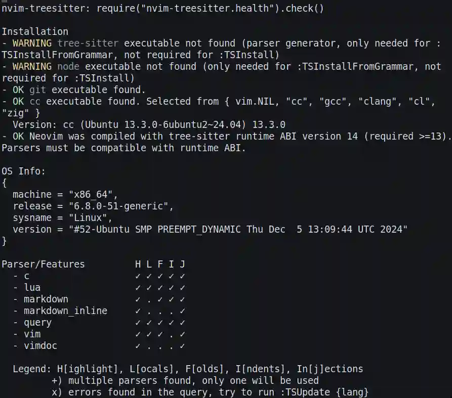
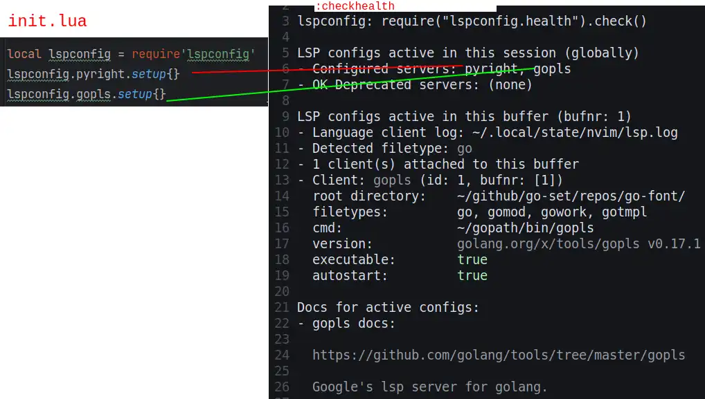
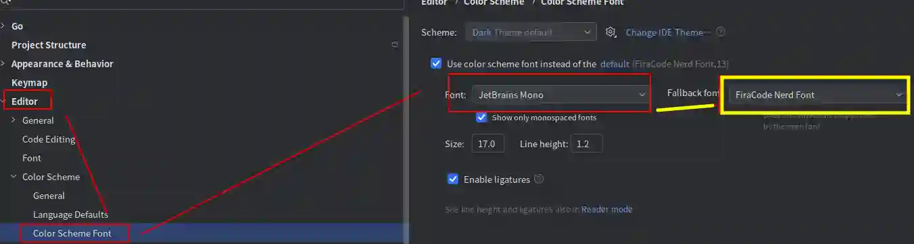

# 專案動機

我從0開始，沒接觸過lua，之前也未用過vim

我會想要自己可以完全作主，所以有需要的功能會自己寫lua來完成 (如果你沒用過lua，問一下AI很快就能進入狀況)

插件盡可能的少用且插件並非透過插件管理器來安裝，而是自己git clone下來放到指定目錄

不過這些項目都有加到submodule之中，因此還是可以快速的完成配置

總之如果你想要自己完全作主，不想要依靠太多的插件，你可以從這個專案的一開始看起

我相信能讓您得到很好的起發😊


# Install neovim

```bash
sudo apt-get install ninja-build gettext cmake unzip curl build-essential
git clone https://github.com/neovim/neovim.git ~/neovim

git checkout v0.11.0 # a99c469

make CMAKE_BUILD_TYPE=RelWithDebInfo

# https://github.com/neovim/neovim/blob/096ae3bfd7075dce69c70182ccedcd6d33e66d31/BUILD.md?plain=1#L16
cd build && cpack -G DEB && sudo dpkg -i "nvim-linux-$(uname -m).deb"

# check
dpkg -l | grep neovim
nvim -V1 -v
```

# Version

`nvim --version`

```
NVIM v0.12.0
Build type: Release
LuaJIT 2.1.1774896198
```

## v0.12.0

0.12.0開始提供內建的插件管理器，當使用

```lua
vim.pack.add({
    "https://github.com/nvim-treesitter/nvim-treesitter",
    "..."

    -- Warn: 裡面可以加上rev, 但是: nvim-pack-lock.json 中可能不會和設定的一樣，所以還是以nvim-pack-lock.json的內容為主，如果有需要調整就去更改它
})
```

會自動來下載，並且儲放於目錄: `$XDG_DATA_HOME/nvim/site/pack/core/opt/`

```vim
:lua print(vim.fn.stdpath('data') .. '/site/pack/core/opt/')
```

在mac下預設是此位置:

```sh
~/.local/share/nvim/site/pack/core/opt/<package_name>

rm -rf ~/.local/share/nvim/site/pack/core/opt
```


並且用: [nvim-pack-lock.json](nvim-pack-lock.json) 來記錄版本


> [!IMPORTANT] nvim.pack.add只負責生成 nvim-pack-lock.json 而真實的版本控管都是靠 nvim-pack-lock.json 也就是就算 `nvim.pack.add` 當中的rev與json不同時，還是以json的資料為主


> [!TIP] 因此如果有新的插件，或者要鎖定插件的版本，只要簡單的用`vim.pack.add()`寫一次套件的下載來源，而真實的版控只要在 nvim-pack-lock.json 寫對
>
> 那麼nvim啟動時，如果發現`$XDG_DATA_HOME/nvim/site/pack/core/opt/`目錄中沒有該套件，就會主動依據json中告知的rev去下載到其版本！


---

如果動到了`~/.local/share/nvim/site/pack/core/opt/`當中某些插件的版本，又想要還原，可以直接刪除該套件目錄，靠`nvim-pack-lock.json`來重新產生

```sh
# 也可以整個目錄都刪除，讓所有內容再次依據`nvim-pack-lock.json`來生成
rm -rf ~/.local/share/nvim/site/pack/core/opt/
```

### ssh

vim.pack.add 會靠git去下載，如果你用的是ssh的方式且有 passphrase 設定，就會沒辦法下載成功

此時可以考慮先將 passphrase 移除

```sh
ssh-keygen -p -f ~/.ssh/myPrivateKey  # 重新設定，都留下空白，就等於移除
# 之後等套件載完了之後，可以再做一次指令，打上原本的密碼，或者一開始就先備份再還原都行
```

如果還是不行在 `~/.ssh/config` 可以考慮新增此內容
```sh
Host github.com
    HostName github.com
    User git
    IdentityFile ~/.ssh/my_key
#                 👆 換成你的key
```


接著用`ssh git@github.com`測試，若成功即可


# INSTALL carson/nvim

```sh
mkdir -p ~/.config/nvim
git clone https://github.com/CarsonSlovoka/nvim.git ~/.config/nvim
cd ~/.config/nvim
git submodule update --init --recursive

# (可選) 初始化自定義永定書籤 (此檔案如果沒有, 會幫忙生成)
echo 'return {
   { name = "Documents", path = "~/Documents" },
   { name = "Downloads", path = "~/Downloads" },
}' >> ~/.config/nvim/bookmarks/default.lua


# (可選) 安裝Nerd Fonts
wget https://github.com/ryanoasis/nerd-fonts/releases/download/v3.3.0/FiraCode.zip
unzip FiraCode.zip -d ~/.fonts
rm -v *.zip
echo 'font=FiraCodeNerdFontMono-Retina:size=14' >> ~/.config/foot/foot.ini # 設定終端機的字型


# (可選) 為了javascript的lsp
sudo npm install -g typescript-language-server typescript
typescript-language-server -V
sudo npm install -g prettier # 可以格式化
prettier -v
# 3.6.2
tee ~/.prettierrc << EOF
{
  "semi": false,
  "endOfLine": "lf",
  "overrides": [
    {
      "files": "*.jxa",
      "options": {
        "parser": "babel"
      }
    }
  ]
}
EOF
# Note: 如果想要更改，還是可以在專案中再新增 .prettierrc 會用最先抓到的當成設定檔


# deno fmt 配置: 沒有預設的全域設定，只能在各別的專案中調整
# https://docs.deno.com/runtime/fundamentals/linting_and_formatting/
# https://docs.deno.com/runtime/fundamentals/configuration/#formatting
# tee path/to/deno.json << EOF
# {
#   "fmt": {
#     "semiColons": false
#   }
# }
# EOF

# (可選) 安裝sqls
# https://github.com/sqls-server/sqls
go install github.com/sqls-server/sqls@latest
sqls --version
# dsqls version Version:0.2.28, Revision:HEAD

```

windows的font family切換可以參考[windows.md](docs/windows.md#Fonts)

> 如果有需要還要安裝想要的[lsp server](#安裝語言伺服器)


添加doc

```bash
# (可選) tags
# ALL 會將所有runtimepath，有doc的資料夾自動去生成 tags 目錄
:helptags ALL

# 你也可以選擇各別添加
:helptags ~/.config/nvim/doc
:helptags ~/.config/nvim/pack/search/start/telescope.nvim/doc/
:helptags ~/.config/nvim/pack/git/start/gitsigns.nvim/doc/
:helptags ~/.config/nvim/pack/tree/start/nvim-tree.lua/doc/
# > 會在該目錄下生成出tags的文件，如果這些目錄在runtimepath下，就會自動生成文檔
```

## [ripgrep](https://github.com/BurntSushi/ripgrep) (可選)

```sh
sudo apt install ripgrep
```

windows可以來此頁面: https://github.com/BurntSushi/ripgrep/releases/tag/14.1.1 找到合適的選項下載,

例如: [ripgrep-14.1.1-x86_64-pc-windows-gnu.zip](https://github.com/BurntSushi/ripgrep/releases/download/14.1.1/ripgrep-14.1.1-x86_64-pc-windows-gnu.zip)

完成之後解壓縮，並設定該目錄可以讓環境變數`PATH`抓到rg.exe, 例如: `C:\usr\bin\ripgrep\rg.exe`

# 目錄結構

- ✅ 表示目前已經有實作
- 沒有標記的部份就只是目前規劃

```lua
~/.config/nvim/
├── init.lua                         -- ✅ 主入口配置文件
├── bookmarks/                       -- ✅ 自定義永久書籤的內容
│   ├── default.lua                  -- 預設的永久書籤
│   ├── other_bookmark.lua           -- (可選) 其他永久書籤
│   └── ...
├── doc/                             -- ✅ nvim的幫助文檔(可用:help找尋關聯tag)
├── pack/                            -- 🔹 git rev-parse --short HEAD | wl-copy 🔹 git branch -v
│   ├── syntax/start/
│   │          ├── nvim-treesitter              -- ✅ 語法高亮 (99dfc5a 2026-01-04)
│   │          ├── nvim-treesitter-context      -- ✅ 頂端凍結函數名 (v1.0.0... 59f318a)
│   │          └── nvim-treesitter-textobjects  -- ✅ visual下的選取, 移動(function, class), 參數交換 (需要先裝nvim-treesitter以及lsp之後才能有效使用) (28a3494 2026-01-02)
│   │
│   ├── lsp/start/                   -- ✅ language server protocol
│   │       │
│   │       └── nvim-lspconfig/      -- 🚮 從nvim 0.11開始，這已經不需要了, 不過當中的語言設定檔還是有一些參考價值
│   │
│   ├── git/start/                   -- ✅ git
│   │       │
│   │       └── gitsigns.nvim/       -- ✅ 編輯的時候，可以看到git上的異動(新增, 刪除, 修改...) (v2.0.0...  6bd2949 2026-01-01)
│   │
│   ├── motion/start/                -- ✅ 移動相關 2b68ddc
│   │          ├── leap.nvim         -- ✅ 用兩鍵的方式來移動，預設觸發鍵為s (f19d435 2025-12-04)
│   │          ├── hop.nvim          -- 🚮 使用模糊搜尋來快速移動. 熱鍵f, F, t, T (v2.7.2... efe5818) -- 我後來選擇用vim預設的motion即可，你可以參考 :help motion.txt 把你面的東西看完，會發現預設的動作其實也不慢！
│   │          └── precognition.nvim -- ⚠ 可以幫助您學習vi,它會提示可以如何移動  (v1.1.0... 531971e) -- 這個可能是一個過度期會用到的東西，等你熟了以後應該是不再需要了，所以我已經移除，你可以選擇自己再加回
│   │
│   ├── icon/start/                  -- ✅ 圖標類
│   │        └── nvim-web-devicons   -- ✅ 可豐富nvim-tree的導覽，替其新增圖標 (40e9d5a 2026-04-03) ([github-nvim-theme](#github-nvim-theme)可以輔助)
│   │
│   ├── tree/start/                  -- ✅ 導覧相關
│   │        └── nvim-tree.lua       -- ✅ 左測目錄導覽(還可創建目錄,重新命名,...) (v1.14.0  321bc615)
│   │
│   ├── search/start/                -- ✅ 搜尋相關
│   │          ├── telescope.nvim    -- ✅ 可以找文件, 搜索文本, 查看大綱(需與lsp配合)... (3333a52 2025-12-31)
│   │          └── fzf-lua.nvim      -- ✅ 與 telescope.nvim 類似，但是速度更快 ( fd244f2 )
│   │
│   ├── theme/start/                 -- ✅ 主題相關
│   │         └── github-nvim-theme  -- ✅ 配色 (v1.1.2... c106c94)
│   │
│   ├── edit/start/                  -- ✅ 與編輯相關
│   │         └── cmp                -- ✅ 自動完成 (主要依靠`<C-X>`)
│   │
│   ├── sdk/start/
│   │         └── flutter-tools.nvim     -- ✅ 主要用的語言是dart, 而flutter是一個框架, flutter-tools.nvim能提供其lsp與dap相關設定 (v1.14.0... 8fa438f)
│   │
│   ├── other/start/                     -- ✅ 未分類
│   │         ├── render-markdown.nvim   -- ✅ 將markdown渲染的比較好看 (da6a7b2 2026-01-03)
│   │         ├── lualine.nvim           -- ✅ statusbar (47f91c4 2025-11-23)
│   │         └── indent-blankline.nvim  -- ✅ 簡稱為ibl 幫你找出括號配對等等 (v3.8.6 259357f) 考慮到非所有程式都很複雜，因此如果有需要請用指令 :Ibl 去開啟
│   │
│   ├── schedule/start/                  -- ✅ 排程相關
│   │            └── ~~atq.nvim~~        -- ⚠  通知提醒 ( 396ed33 ) -- 不需要用到插件，寫一個簡單的command即可完成: https://github.com/CarsonSlovoka/nvim/blob/62f78b8b2f506b1b4a3eff6006b0fcbbcf06c890/lua/config/commands.lua#L1142-L1223
│   │
│   ├── debug/start/                            -- ✅ debug相關套件集
│   │         ├── nvim-dap                      -- ✅ 一個協議用於neovim上debug等相關事宜(需要再找每一個語言的debug adapter) (03e83f1  2026-01-04) https://microsoft.github.io/debug-adapter-protocol/implementors/adapters/
│   │         ├── nvim-dap-ui                   -- ✅ 取得 require"dapui" (v4.0.0... bc81f8d)
│   │         ├── nvim-nio                      -- ✅ 此為nvim-dap-ui需要用到的插件 (v1.10.1 21f5324)
│   │         ├── nvim-dap-python               -- ✅ debug adapter: python ( 3428282 )
│   │         ├── one-small-step-for-vimkind    -- ✅ debug adapter: lua ( 330049a )
│   │         └── nvim-dap-go                   -- ✅ debug adapter: go ( 8763ced )
│   ├── ios/start/
│   │         └── ~~xcodebuild.nvim~~           -- swift debug相關 (就算要debug swift的專案) e0d54db
│   │
│   ├── tools/start/
│   │         ├── image.nvim                    -- ✅ 使用kitty終端機，能在markdown文件直接看到圖片 ( v1.4.0 446a8a5c )
│   │         ├── pantran.nvim                  -- ✅ 翻譯工具, engine: google, deepl, ... ( b87c3ae4 )
│   │         ├── live-preview.nvim             -- ✅ 即時渲染html, md, svg, ...的結果 2026-03-05 v0.9.6... ( c1fcf75c )
│   │         └── ccc.nvim                      -- ✅ 取色器 v2.0.3... ( 9d1a256 )
│   │
│   ├── view/start/
│   │         └── csvview.nvim       -- ✅ 方便查看和編輯csv ( v1.4.0 9b483f8 )
│   │
│   ├── sql/start/                   -- ✅ sql相關
│   │         └── sqls.nvim          -- ( d1bc542 )
│   │
│   └── utils/start/                 -- ✅ 常用函數包裝
│             ├── ~~nui.nvim~~       -- xcodebuild 需要 de74099
│             └── plenary.nvim       -- ✅ require('plenary.path'):new("~/init.lua").{exists(), is_dir())... (v1.1.4... 2d9b0617)
│
├── ftplugin/                        -- ✅ 依據附檔名才會載入的插件
│   │
│   └── markdown/                    -- ✅ markdown編輯, toc相關
│       ├── editor.lua               -- ✅ editor編輯相關
│       ├── markdown.lua             -- ✅ markdown大綱生成 (除非沒有裝telescope才會用這種模式)
│       └── telescope_markdown.lua   -- ✅ 使用telescope生成markdown大綱
│
├── lua/                             -- ✅ Lua 配置模組的根目錄
│   ├── config/                      -- ✅ 基本設定
│   │   ├── telescope_bookmark.lua   -- ✅ 可以加入書籤(導引到該檔案或目錄)
│   │   ├── options.lua              -- ✅ 基本選項 (e.g., 編輯器行為、外觀設定)
│   │   ├── commands.lua             -- ✅ 自定義的命令(:MyCommand, ...)
│   │   ├── keymaps.lua              -- ✅ 鍵位綁定
│   │   ├── autocmds.lua             -- 自動命令 (autocommands)
│   │   └── ...                      -- 其他相關設定
│   └── utils/                       -- 實用工具函數
│       ├── exec.lua                 -- ✅ 執行工作相關
│       └── ...                      -- 其他工具
├── after/                           -- 用於延遲加載的配置
│   ├── ftplugin/                    -- 文件類型相關的配置
│   ├── syntax/                      -- 語法高亮相關配置
│   └── ...                          -- 其他延遲加載配置
└── README.md                        -- ✅ 簡單說明文件
```

# my-customize.lua

如果你有自定義的設定，可以加在`my-customize.lua`中, 例如:

```sh
echo '
vim.cmd("ToggleDiagnosticVirtualText --quite")
vim.cmd("ToggleDiagnosticHover --quite")
vim.cmd("SetDiagnostics 0")
require("config.autocmd").autoReformat = false
-- vim.opt.runtimepath:append("/path/to/project/") -- 執行`:helptags ALL` 會生成`/path/to/project/doc/tags` 檔案
-- vim.cmd("helptags ALL")
' > ~/.config/nvim/lua/my-customize.lua
```


# pack

```
:help runtimepath
:help :packadd
    pack/*/start/{name}
```

---

有關於插件的位置，其實放在`runtimepath`能找的到的地方都可以

以下指令可查看其所有的位置

```lua
:echo &runtimepath -- 這是一個字串用,串接每一個路徑

:echo join(split(&runtimepath, ','), "\n") -- 先用,拆成array, 在用\n來串接，可以把每一個路徑都呈現
```


```bash
for dir in ./pack/*; do du -hs "$dir"; done
```


## nvim-treesitter

```bash
mkdir -p ~/.config/nvim/pack/syntax/start/ # 建立一個syntax的群組
git clone https://github.com/nvim-treesitter/nvim-treesitter.git ~/.config/nvim/pack/syntax/start/nvim-treesitter
```

```yaml
# 此項目是nvim-treesitter所提供的: https://github.com/nvim-treesitter/nvim-treesitter/blob/096babebf6daef2a046650883082ed2b3dcc5b67/lua/nvim-treesitter/health.lua#L117-L174
:checkhealth
```

[](./pack/syntax/start/nvim-treesitter/lua/nvim-treesitter/health.lua)

```yaml
# 更新
:TSInstall bash lua go gotmpl python xml json jsonc markdown markdown_inline dart elixir sql diff html latex yaml
:TSUninstall  lua sql gotmpl # 目前這幾個會有問題, 所以先移除
# ~~:TSUpdate~~
```


[tree-sitter-cli安裝](https://github.com/tree-sitter/tree-sitter/blob/17e3c7a5c56527a179fa6e37ce7ee934493e5047/crates/cli/README.md?plain=1#L12-L24)

```sh
# ❌ ERROR tree-sitter-cli not found
sudo npm install -g tree-sitter-cli  # 裝完，終端機整個關閉重啟，就不會再看到以上的錯誤，而是以下內容
# ✅ OK tree-sitter-cli 0.26.3 (/opt/homebrew/bin/tree-sitter)
```

### [nvim-treesitter-context](https://github.com/nvim-treesitter/nvim-treesitter-context)

```bash
git clone https://github.com/nvim-treesitter/nvim-treesitter-context.git ~/.config/nvim/pack/syntax/start/nvim-treesitter-context
```


### [nvim-treesitter-textobjects](https://github.com/nvim-treesitter/nvim-treesitter-textobjects)

```bash
git clone https://github.com/nvim-treesitter/nvim-treesitter-textobjects.git ~/.config/nvim/pack/syntax/start/nvim-treesitter-textobjects
```

---

此插件只要裝好就可以了，配置了話，要直接在[nvim-treesitter](#nvim-treesitter)的設定新增`textobjects`再輸入想要的內容即可

```lua
require 'nvim-treesitter.configs'.setup {
    textobjects = {
        select = {
            -- ...
        },
        move = {
            -- ...
        },
        swap = {
            -- ...
        }
    }
}
```

```yaml
:TSUpdate
```

測試用腳本

```go
package main

import (
	"fmt"
)

// Add is a simple function that adds two integers.
func Add(a int, b int) int {
	result := a + b
	return result
}

// Subtract is a simple function that subtracts one integer from another.
func Subtract(a int, b int) int {
	return a - b
}

type Calculator struct {
	Name string
}

// Multiply multiplies two integers.
func (c Calculator) Multiply(a int, b int) int {
	return a * b
}

func main() {
	calculator := Calculator{Name: "Basic Calculator"}
	fmt.Println(calculator.Multiply(3, 4))
}
```

## lsp

1. ~~下載LSP~~
2. 安裝語言伺服器
3. 編輯init.lua: `require'lspconfig'.gopls.setup{}`



### ~~下載lsp(language server protocol)~~ (已不再需要)

```bash
## 這個只是protocol, 至於server還是要再另外安裝
mkdir -p ~/.config/nvim/pack/lsp/start
git clone https://github.com/neovim/nvim-lspconfig.git ~/.config/nvim/pack/lsp/start/nvim-lspconfig
```

> [!NOTE] 可以參考裡面的設定檔，至於安裝則是不用了

### 安裝語言伺服器

#### go

```
go install golang.org/x/tools/gopls@latest
which gopls
# $GOPATH/bin/gopls
```

> 注意! 當你的go版本有更新的時候，可能要重新再執行一次命令此命令來得到最新版本的解析器
>
> 不然在診斷(diagnostic)上可能會看到錯誤或警告


#### python

<details>
<summary>👎用虛擬環境(不推薦)</summary>

```bash
pyenv virtualenv 3.13.0 pyright-env
pyenv activate pyright-env
pyenv versions # check switch
python -m pip install --upgrade pip
pip install pyright
pip freeze
# nodeenv==1.9.1
# pyright==1.1.391
# typing_extensions==4.12.2
pyenv deactivate
which pyright | wl-copy
# vim.g.lsp_pyright_path = vim.fn.expand('~/.pyenv/shims/pyright') # 貼上路徑

# 進入nvim之前要啟用虛擬環境, 才會有作用, 而且相關的python套件也要在該虛擬環境有，不然也沒辦法做檢測
pyenv activate pyright-env
nivm ~/test.py
```
</details>

建議安裝在全局上，可以省得麻煩
```bash
pyenv versions # 看本機有的python版本或者確認當前使用的python版本

# 安裝指定版本 (如果已經安裝可以省略)
pyenv install 3.13.0

# 啟用指定版本的python
pyenv global 3.13.0

# 安裝pyright
pip install pyright
pip freeze | grep pyright
# pyright==1.1.399
which pyright | wl-copy
# vim.g.lsp_pyright_path = vim.fn.expand('~/.pyenv/shims/pyright') # 貼上路徑

# 取得black, isort兩個格式化python用的工具
pip install black isort

# debugpy 在debug python的時候會需要用到: https://github.com/microsoft/debugpy
pip install debugpy
```

#### [bash-language-server](https://github.com/bash-lsp/bash-language-server)

install from [snap](https://snapcraft.io/install/bash-language-server/ubuntu)

```bash
sudo snap install bash-language-server --classic
snap list | grep bash-language-server
# bash-language-server   4.7.0  69   latest/stable    alexmurray*  classic
```

另一種方式是透過npm

```bash
# choco install nodejs -y # 如果是windows，可以考慮用choco來裝nodejs裡面就會有提供npm工具
# choco upgrade nodejs # 需要管理員權限
# npm --version # 10.8.3
# npm install -g npm@11.1.0 # 如果nodejs的版本太舊會沒辦法更新npm

npm i -g bash-language-server
```

#### [markdown-oxide](https://github.com/Feel-ix-343/markdown-oxide)

這是用rust寫的項目，如果還沒有安裝rust可以先[安裝](https://rust-lang.github.io/rustup/installation/other.html#other-installation-methods)

安裝好了之後可以得到cargo，就可以透過cargo安裝


**install rust**

```yaml
# curl --proto '=https' --tlsv1.2 -sSf https://sh.rustup.rs | sh -s -- --help
curl --proto '=https' --tlsv1.2 -sSf https://sh.rustup.rs | sh -v
# metadata and tool chains
ls ~/.rustup
ls ~/.cargo
ls ~/.cargo/bin # cargo, cargo-fmt, rustfmt, ...
# ~/.profile # 會自動添加 `. "$HOME/.cargo/env"`
# ~/.bashrc # 會自動添加 `. "$HOME/.cargo/env"`
```

<details>

<summary>sh.rustup.rs的互動訊息</summary>

```
Welcome to Rust!

This will download and install the official compiler for the Rust
programming language, and its package manager, Cargo.

Rustup metadata and toolchains will be installed into the Rustup
home directory, located at:

  ~/.rustup

This can be modified with the RUSTUP_HOME environment variable.

The Cargo home directory is located at:

  ~/.cargo

This can be modified with the CARGO_HOME environment variable.

The cargo, rustc, rustup and other commands will be added to
Cargo's bin directory, located at:

  ~/.cargo/bin

This path will then be added to your PATH environment variable by
modifying the profile files located at:

  ~/.profile
  ~/.bashrc

You can uninstall at any time with rustup self uninstall and
these changes will be reverted.

Current installation options:


   default host triple: x86_64-unknown-linux-gnu
     default toolchain: stable (default)
               profile: default
  modify PATH variable: yes

1) Proceed with standard installation (default - just press enter)
2) Customize installation
3) Cancel installation
```

</details>

> 安裝完成之後，記得重新啟動終端機！


```sh
cargo -V
# cargo 1.84.1 (66221abde 2024-11-19)
```

**[install markdown-oxide](https://github.com/Feel-ix-343/markdown-oxide/tree/main?tab=readme-ov-file#vscode)**

```sh
cargo install --locked --git https://github.com/Feel-ix-343/markdown-oxide.git markdown-oxide # 如果日後有更新, 可以再用同樣的指令即可
cargo install --list | grep markdown-oxide
# markdown-oxide v0.25.8 (https://github.com/Feel-ix-343/markdown-oxide.git#7365fbe5)
ls -l $(which markdown-oxide)
# ~/.cargo/bin/markdown-oxide

# cargo uninstall markdown-oxide
```

> [!NOTE] cargo 安裝的動作, 可能要先將 `[url "github:"]` 先移除才能安裝


#### [clangd](https://github.com/clangd/clangd)

```sh
sudo apt install clangd # 113MB
ls -l $(which clangd)
# /usr/bin/clangd -> clangd-18
```

---

windows: 可以到此[頁面](https://github.com/llvm/llvm-project/releases)，找一個喜歡的版本去下載,

例如: [LLVM-20.1.0-rc1-win64.exe](https://github.com/llvm/llvm-project/releases/download/llvmorg-20.1.0-rc1/LLVM-20.1.0-rc1-win64.exe)

選擇要安裝的目錄，假設你是裝在`D:\LLVM`, 那麼最後得到的clangd的位置是

( 建議可以直接勾選添加環境變數，否則你要自己找出clangd的位置添加到PATH

```
(gcm clangd.exe).Source
# D:\LLVM\bin\clangd.exe
```


#### [lua-language-server](https://github.com/luals/lua-language-server)

```sh
# 下載並且放到自己想要的目錄
VERSION='3.15.0' # 查看版本: https://github.com/LuaLS/lua-language-server/releases
uname -m # 查看arch
ARCH=linux-x64
ARCH=linux-arm64
ARCH=darwin-arm64
wget https://github.com/LuaLS/lua-language-server/releases/download/$VERSION/lua-language-server-$VERSION-$ARCH.tar.gz
du -hs *.tar.gz
# 3.7M lua-language-server-$VERSION-$ARCH.tar.gz
mkdir -pv ~/lua-language-server/ # 依照個人喜號設定，我是選擇放到家目錄下
mv -v lua-language-server-$VERSION-$ARCH.tar.gz ~/lua-language-server/

# 解壓縮
cd ~/lua-language-server/
tar -xzvf lua-language-server-$VERSION-$ARCH.tar.gz # 於此目錄解壓縮，它不會在有多餘的目錄，直接會把檔案展開於此目錄
rm -v lua-language-server-$VERSION-$ARCH.tar.gz
ls -l ~/lua-language-server/bin/lua-language-server # 此檔案為執行檔

# 連立連結
sudo ln -s ~/lua-language-server/bin/lua-language-server /usr/bin/
ls -l /usr/bin/lua-language-server

# Warn: 在mac上, 除非禁用SIP不然建立連結時候會遇到: `Operation not permitted` 的錯誤, 所以可以考慮直接新增環境變數
echo 'export PATH="$PATH:$HOME/lua-language-server/bin"' >> ~/.zshrc

# 確認
lua-language-server --version
```

#### [vscode-langservers-extracted](https://github.com/hrsh7th/vscode-langservers-extracted)

```bash
# npm view npm version           # 查看目前最新版本的npm版號
# sudo npm install npm@latest -g # (可選) 直接更新到最後一版

sudo npm i -g vscode-langservers-extracted
npm info vscode-langservers-extracted # 看套件資訊，當中也可以看到版號: vscode-langservers-extracted@4.10.0
```

```bash
ls -l $(which vscode-html-language-server)
...
ls -l $(which vscode-eslint-language-server )
# /usr/bin/vscode-html-language-server -> ../lib/node_modules/vscode-langservers-extracted/bin/vscode-html-language-server
ls -l /usr/lib/node_modules/vscode-langservers-extracted/bin/
# vscode-css-language-server
# vscode-eslint-language-server
# vscode-html-language-server
# vscode-json-language-server
# vscode-markdown-language-server
```


#### swift

```sh
# https://github.com/swiftlang/swiftly
# 安裝swiftly
curl -O https://download.swift.org/swiftly/linux/swiftly-$(uname -m).tar.gz && \
  tar zxf swiftly-$(uname -m).tar.gz && \
  ./swiftly init --quiet-shell-followup && \
  . "${SWIFTLY_HOME_DIR:-$HOME/.local/share/swiftly}/env.sh" && \
  hash -r

# 設定環境變數
tee -a ~/.bashrc <<EOF
# swift
export SWIFTLY_HOME_DIR=\$HOME/.local/share/swiftly
export SWIFTLY_BIN_DIR=\$HOME/.local/share/swiftly/bin
export SWIFTLY_TOOLCHAINS_DIR=\$HOME/.local/share/swiftly/toolchains
if [[ ":\$PATH:" != *":\$SWIFTLY_BIN_DIR:"* ]]; then
    # 如果當前的環境變數中沒有 \$SWIFTLY_BIN_DIR 的目錄才會加入
    export PATH="\$SWIFTLY_BIN_DIR:\$PATH"
fi
EOF
```

Caution: Xcode/Command Line Tools (CLT) 已经包含了 {swift, swiftc, swift build}等工具，可以不需要再裝swiftly
mac os

```sh
curl -O https://download.swift.org/swiftly/darwin/swiftly.pkg && \
    installer -pkg swiftly.pkg -target CurrentUserHomeDirectory && \
    ~/.swiftly/bin/swiftly init --quiet-shell-followup && \
    . "${SWIFTLY_HOME_DIR:-$HOME/.swiftly}/env.sh" && \
    hash -r
echo "source \$HOME/.swiftly/env.sh" >> ~/.zshrc
rm -v swiftly.pkg
swiftly --version
# 1.1.0

# 解除安裝:
rm -rfv ~/.swiftly
# 更新: ~/.zshrc
which swift
which swiftc
# /usr/bin/swiftc  # 看到的就會是/usr/bin的位置, 而不是來至於swiftly
```


##### 取得codelldb (debug用)
mkdir -v ~/codelldb

> https://github.com/vadimcn/codelldb/releases/

```sh
wget https://github.com/vadimcn/codelldb/releases/download/v1.11.5/codelldb-linux-x64.vsix    -O ~/codelldb/codelldb.zip # 52.34M
wget https://github.com/vadimcn/codelldb/releases/download/v1.11.8/codelldb-darwin-arm64.vsix -O ~/codelldb/codelldb.zip
unzip ~/codelldb/codelldb.zip -d ~/codelldb/
du -hs ~/codelldb/
# 164M
rm -v ~/codelldb/codelldb.zip
```

> [!IMPORTANT]
> 在mac上不需要安裝codelldb, 使用xcode的工具就可以debug了
>
> `rm -rfv ~/codelldb/`

#### rust

```sh
# 🟧 lsp
rustup component add rust-analyzer
rust-analyzer --version
# rust-analyzer 1.92.0 (ded5c06c 2025-12-08)


# 🟧 codelldb (為了debug)
mkdir -pv ~/codelldb
# https://github.com/vadimcn/codelldb/releases/download/
wget https://github.com/vadimcn/codelldb/releases/download/v1.12.1/codelldb-darwin-arm64.vsix -O ~/codelldb/codelldb.zip
cd ~/codelldb
unzip ~/codelldb
```


## ios

```bash
mkdir -pv ~/.config/nvim/pack/ios/start
```

### ~~xcodebuild.nvim~~

> [!IMPORTANT] 可以不需要安裝, 自己手動打命令就好

```sh
git clone https://github.com/wojciech-kulik/xcodebuild.nvim.git ~/.config/nvim/pack/ios/start/xcodebuild.nvim
cd ~/.config/nvim/pack/ios/start/xcodebuild.nvim
make install
# https://github.com/wojciech-kulik/xcodebuild.nvim/blob/e0d54db14ae87ac1cc205e31de5923565a33882c/Makefile#L34-L37
# 成功後會看到類似以下的訊息👇
# pipx install pymobiledevice3 --quiet
#   installed package pymobiledevice3 7.0.5, installed using Python 3.14.2
#   These apps are now globally available
#     - pymobiledevice3
# done! ✨ 🌟 ✨


# https://github.com/wojciech-kulik/xcodebuild.nvim/wiki/Neovim-Configuration
brew install xcode-build-server
xcode-build-server config -project <xcodeproj> -scheme <scheme>

# :checkhealth xcodebuild
# :help xcodebuild.remote-debugger
```

## motion

```bash
mkdir -pv ~/.config/nvim/pack/motion/start/
```

### [precognition](https://github.com/tris203/precognition.nvim.git)

```bash
git clone https://github.com/tris203/precognition.nvim.git ~/.config/nvim/pack/motion/start/precognition.nvim
```

> 插件特色: https://www.youtube.com/watch?v=7hQZhHve4HI


### 🚮 ~~[hop.nvim](https://github.com/smoka7/hop.nvim)~~ 建議使用leap.nvim


```bash
git clone https://github.com/smoka7/hop.nvim.git ~/.config/nvim/pack/motion/start/hop.nvim
```

### [leap.nvim](https://github.com/ggandor/leap.nvim.git)


```sh
git clone https://github.com/ggandor/leap.nvim.git ~/.config/nvim/pack/motion/start/leap.nvim
```

熱鍵: `:help leap-mappings`

- s: leap
- S: leap from window


## git

```bash
mkdir -pv ~/.config/nvim/pack/git/start/
```

### [gitsigns.nvim](https://github.com/lewis6991/gitsigns.nvim)

```bash
git clone https://github.com/lewis6991/gitsigns.nvim.git ~/.config/nvim/pack/git/start/gitsigns.nvim
```

## tree

```bash
mkdir -pv ~/.config/nvim/pack/tree/start/
```

### [nvim-tree.lua](https://github.com/nvim-tree/nvim-tree.lua)

```bash
git clone https://github.com/nvim-tree/nvim-tree.lua.git ~/.config/nvim/pack/tree/start/nvim-tree.lua
```

#### 解決亂碼: Nerd Fonts

下載 [Nerd Fonts](https://www.nerdfonts.com/)

```bash
wget https://github.com/ryanoasis/nerd-fonts/releases/download/v3.3.0/FiraCode.zip
unzip FiraCode.zip -d ~/.fonts
du -hs ~/.fonts # 45M

# 刷新字體緩存(非必要樣)
fc-cache -fv

# 查看是否安裝成功
fc-list | grep "FiraCode"
# ~/.fonts/FiraCodeNerdFontMono-Retina.ttf: FiraCode Nerd Font Mono,FiraCode Nerd Font Mono Ret:style=Retina,Regular

rm *.zip
```

記得還要在終端機上換掉字型才可以

以foot終機為例，要在foot.int做以下調整
```yaml
# foot.ini
font=FiraCodeNerdFontMono-Retina:size=14
```

> 如果想讓圖標比較豐富可以再安裝[nvim-web-devicons](#nvim-web-devicons)

---

我建議在您的其它編輯器上也裝上FiraCodeNerdFont, 如果不想要至少讓備用字型是它，以防缺字的情況




## icon

```bash
mkdir -pv ~/.config/nvim/pack/icon/start/
```

### [nvim-web-devicons](https://github.com/nvim-tree/nvim-web-devicons)

```bash
git clone https://github.com/nvim-tree/nvim-web-devicons.git ~/.config/nvim/pack/icon/start/nvim-web-devicons
```

## utils

```sh
mkdir -pv ~/.config/nvim/pack/utils/start/
```

### [plenary](https://github.com/nvim-lua/plenary.nvim)

是一個語法糖套件，也有些插件也會使用到此插件，例如

- [telescope.nvim](#telescope)
- vgit.nvim
- neogit
- neo-tree.nvim

---

安裝:

```sh
git clone https://github.com/nvim-lua/plenary.nvim ~/.config/nvim/pack/utils/start/plenary.nvim
```

#### USAGE

它共有提供以下這些[模組](https://github.com/nvim-lua/plenary.nvim/blob/2d9b06177a975543726ce5c73fca176cedbffe9d/README.md?plain=1#L29-L39)

- plenary.async
- plenary.async_lib
- plenary.job
- plenary.path
- plenary.scandir
- plenary.context_manager
- plenary.test_harness
- plenary.filetype
- plenary.strings


##### Path

```lua
local Path=require('plenary.path')
local path = Path:new("~/.config/nvim/init.lua")
print(path:exists()) -- 文件是否存在
print(path:is_dir()) -- 是否為一個目錄
```

##### test_harness

```lua
local tests = require('plenary.test_harness')
tests.describe('basic tests', function()
  tests.it('should add numbers', function()
    assert.are.same(2 + 2, 4)
  end)
end)
```


### nui.nvim

[xcodebuild](https://github.com/wojciech-kulik/xcodebuild.nvim/wiki#2-install-plugin)需要用到此插件

```sh
git clone https://github.com/MunifTanjim/nui.nvim.git ~/.config/nvim/pack/utils/start/nui.nvim
```

## search

```sh
mkdir -pv ~/.config/nvim/pack/search/start/
```

### [telescope](https://github.com/nvim-telescope/telescope.nvim)

此插件需要用到[plenary](#plenary)

```sh
git clone https://github.com/nvim-telescope/telescope.nvim ~/.config/nvim/pack/search/start/telescope.nvim
```

### [fzf-lua](https://github.com/ibhagwan/fzf-lua)

```sh
git clone --depth 1 https://github.com/ibhagwan/fzf-lua ~/.config/nvim/pack/search/start/fzf-lua
```

```vim
:lua require("fzf-lua").files()
:FzfLua files cwd=~/.config  " 之後的可選項可以用tab叫出，但是當中的數值需要自己完成
:FzfLua files     " 找檔案
:FzfLua git_files " 找檔案(git提交的)
:FzfLua lines     " 找內文(僅限: 當前檔案)
:FzfLua live_grep " 找內文

:lua FzfLua.live_grep({resume=true}) -- 透過resume可以接續上一次的搜尋, 所有的項目都可以加上resume
:lua FzfLua.git_files({resume=true})
:FzfLua git_files resume=true " 也可以這樣來簡化

:checkhealth fzf_lua
```

## theme

```sh
mkdir -pv ~/.config/nvim/pack/theme/start/
```

### [github-nvim-theme](https://github.com/projekt0n/github-nvim-theme)

```sh
git clone https://github.com/projekt0n/github-nvim-theme.git ~/.config/nvim/pack/theme/start/github-nvim-theme
```

## sdk

```sh
mkdir -pv ~/.config/nvim/pack/sdk/start/
```

### [flutter-tools.nvim](https://github.com/nvim-flutter/flutter-tools.nvim)

```
git clone https://github.com/nvim-flutter/flutter-tools.nvim ~/.config/nvim/pack/sdk/start/flutter-tools.nvim
```


## other

```sh
mkdir -pv ~/.config/nvim/pack/other/start/
```

### [indent-blankline.nvim](https://github.com/lukas-reineke/indent-blankline.nvim)

```sh
git clone https://github.com/lukas-reineke/indent-blankline.nvim.git ~/.config/nvim/pack/other/start/indent-blankline.nvim
```

### [lualine.nvim](https://github.com/nvim-lualine/lualine.nvim)

```sh
git clone https://github.com/nvim-lualine/lualine.nvim.git ~/.config/nvim/pack/other/start/lualine.nvim
```


### [render-markdown.nvim](https://github.com/MeanderingProgrammer/render-markdown.nvim)

```sh
git clone https://github.com/MeanderingProgrammer/render-markdown.nvim.git ~/.config/nvim/pack/other/start/render-markdown.nvim
```


## schedule

```sh
mkdir -pv ~/.config/nvim/pack/schedule/start/
```

### ~~[atq.nvim](https://github.com/CarsonSlovoka/atq.git)~~ (使用`:NotifySend`  即可)

```sh
git clone https://github.com/CarsonSlovoka/atq.git ~/.config/nvim/pack/schedule/start/atq.nvim
```

## edit

```sh
mkdir -pv ~/.config/nvim/pack/edit/start/
```

### [cmp.nvim](https://github.com/CarsonSlovoka/cmp.git)

```sh
git clone https://github.com/CarsonSlovoka/cmp.git ~/.config/nvim/pack/edit/start/cmp.nvim
```

## debug

```sh
mkdir -pv ~/.config/nvim/pack/debug/start/
```

### [go-delve](https://github.com/go-delve/delve)

類似於gdb, 不過在go語言上會推薦用go-delve會更好

```sh
# Warn: 如果go的版本太新, 而dlv的工具沒有跟上，就會沒辦法debug
go install github.com/go-delve/delve/cmd/dlv@latest
dlv version
# Version: 1.26.0
# Build: $Id: 7fd7302eab8b16d715a94af1b5dfbffc2e1359bc
```


### [nvim-dap](https://github.com/mfussenegger/nvim-dap)

dap(Debug Adapter Protocol), 要有這個才可以在neovim上debug (接著還要自己找每一個語言用的debug adapter)

```sh
git clone https://github.com/mfussenegger/nvim-dap.git ~/.config/nvim/pack/debug/start/nvim-dap
```

#### [debug adapter](https://github.com/mfussenegger/nvim-dap/blob/master/doc/dap.txt)

##### go [nvim-dap-go](https://github.com/leoluz/nvim-dap-go)

```sh
git clone https://github.com/rcarriga/nvim-dap-ui.git ~/.config/nvim/pack/debug/start/nvim-dap-ui # require"dapui"
git clone https://github.com/nvim-neotest/nvim-nio.git ~/.config/nvim/pack/debug/start/nvim-nio # nvim-dap-ui需要用到的插件
git clone https://github.com/leoluz/nvim-dap-go.git ~/.config/nvim/pack/debug/start/nvim-dap-go
```


##### python [nvim-dap-python](https://github.com/mfussenegger/nvim-dap-python)

```sh
# pip install debugpy # nvim-dap-python 有需要依賴debugpy這個工具
git clone https://github.com/mfussenegger/nvim-dap-python.git ~/.config/nvim/pack/debug/start/nvim-dap-python
```


##### lua

分為兩個版本:

- one-small-step-for-vimkind: 這是attact在nvim下
- local-lua-debugger-vscode: 這個以呼叫外部的lua執行檔，例如: lua5.1, lua5.2, ..., lua5.4

###### [one-small-step-for-vimkind](https://github.com/jbyuki/one-small-step-for-vimkind)

```sh
git clone https://github.com/jbyuki/one-small-step-for-vimkind.git ~/.config/nvim/pack/debug/start/one-small-step-for-vimkind
```

###### [local-lua-debugger-vscode](https://github.com/tomblind/local-lua-debugger-vscode)

> [!TIP]
> 這個項目不是nvim的插件，所以不需要安裝到pack下也可以

```sh
git clone https://github.com/tomblind/local-lua-debugger-vscode.git ~/.local/share/nvim/lsp_servers/local-lua-debugger-vscode
cd ~/.local/share/nvim/lsp_servers/local-lua-debugger-vscode
git checkout d51ee290 # version bump to 0.3.3 # Date: 2022-04-03 (日) 17:46:07 -0600
npm install
# npm audit fix
npm audit fix --force # xml2js  <0.5.0
npm audit fix --force # markdown-it  <12.3.2
```

開啟

[package.json](~/.local/share/nvim/lsp_servers/local-lua-debugger-vscode/package.json)

```jsonc
{
  // ... 原有內容 ...
  "overrides": { // 👈 新增這一段
    "xml2js": "^0.6.2"
  }
}
```

```sh

npm audit fix --force
# found 0 vulnerabilities # 如果看到結尾是這樣就可以install了
npm install
npm run bundle # 為 package.json 中的 scripts 的內容之一
```

做完之後相關的[ts](~/.local/share/nvim/lsp_servers/local-lua-debugger-vscode/extension/debugAdapter.ts)檔案，就會生成出[js](~/.local/share/nvim/lsp_servers/local-lua-debugger-vscode/extension/debugAdapter.js)的版本


## view

```sh
mkdir -pv ~/.config/nvim/pack/view/start/
```

### [csvview.nvim](https://github.com/hat0uma/csvview.nvim)


```sh
git clone https://github.com/hat0uma/csvview.nvim.git ~/.config/nvim/pack/view/start/csvview.nvim
```


## sql


```sh
mkdir -pv ~/.config/nvim/pack/sql/start/
```


### sqls

```sh
git clone https://github.com/nanotee/sqls.nvim.git ~/.config/nvim/pack/sql/start/sqls.nvim
```

#### [command](https://github.com/nanotee/sqls.nvim/blob/d1bc5421ef3e8edc5101e37edbb7de6639207a09/doc/sqls-nvim.txt#L14-L87)

```vim
SqlsSwitchConnection " 切換連線
SqlsExecuteQuery " 執行sql文件或者只執行選取的內容
SqlsExecuteQueryVertical " 同Query只是輸出的樣式不同
SqlsShowTables " 顯示當前連線中的所有tables
" ...

SqlsInsertConnecions " 此為我新增的命令, 新增連線
```

## tools

```sh
mkdir -pv ~/.config/nvim/pack/tools/start/
```

### [image.nvim](https://github.com/3rd/image.nvim)

```sh
git clone https://github.com/3rd/image.nvim.git ~/.config/nvim/pack/tools/start/image.nvim
```

### [pantran.nvim](https://github.com/potamides/pantran.nvim)


```sh
git clone https://github.com/potamides/pantran.nvim.git ~/.config/nvim/pack/tools/start/pantran.nvim
```

### [ccc.nvim](https://github.com/uga-rosa/ccc.nvim)

```
git clone https://github.com/uga-rosa/ccc.nvim.git ~/.config/nvim/pack/tools/start/ccc.nvim
```

- `:CccConvert` 在選取的色彩文字上使用, 可以做轉換

    ```
    #ff00ff
    ```

- `:CccPick` 如果在使用此command的文字上符合色彩的定義(rgb, #ffffff, hsl)則預設會用該色彩去呈現
    - i 切換不同的色彩模式
    - j, k 往下, 往上移動
    - l 該數值加1
    - h 減1
    - a 新增alpha通道
    - 0, 1, ... 9: 設定該數值所佔的比率

### [live-preview.nvim](https://github.com/brianhuster/live-preview.nvim)

<span>
    
    
    
</span>


```sh
git clone --depth 1 https://github.com/brianhuster/live-preview.nvim ~/.config/nvim/pack/tools/start/live-preview.nvim
```

```vim
:LivePreview pick " 在目前的工作目錄中，挑選出可以執行的項目
:LivePreview start " 預設用當前buffer的檔案 (附檔名需要一致，不是看filetype)
" NOTE: 一次只能啟動一個項目，不能start之後又再去start其它的，要先close才行
" :LivePreview start ~/my.svg " ❌ 不支持路徑的expand
:LivePreview start redir/my.svg " ⚠️ 可以指定文件路徑，但是路徑只適用相對路徑

:LivePreview close " 結束
```

> [!WARNING] 如果執行失敗，就算close後再start也沒用，需要整個重啟


# [neovide](https://github.com/neovide/neovide)

提供一個neovim的GUI, [特色](https://neovide.dev/features.html)

## Installation

### linux

Ubuntu/Debian
```sh
sudo apt install -y curl \
    gnupg ca-certificates git \
    gcc-multilib g++-multilib cmake libssl-dev pkg-config \
    libfreetype6-dev libasound2-dev libexpat1-dev libxcb-composite0-dev \
    libbz2-dev libsndio-dev freeglut3-dev libxmu-dev libxi-dev libfontconfig1-dev \
    libxcursor-dev

# 安裝rust(如果已經裝了，可以略過)來取得cargo
curl --proto '=https' --tlsv1.2 -sSf "https://sh.rustup.rs" | sh -v

# fetch and build
cargo install --git https://github.com/neovide/neovide
# (如果你用ssh, 可以暫時先將~/.gitconfig相關的url有關於https://github.com先註解掉裝完再恢復)

cargo install --list
ls -l $(which neovide)
# ~/.cargo/bin/neovide
neovide -V
# neovide 0.14.0
```

### windows

你可以到release的[頁面](https://github.com/neovide/neovide/releases)下載, 例如[0.14.0 neovide.msi](https://github.com/neovide/neovide/releases/download/0.14.0/neovide.msi)，接著點選後安裝完畢，就會得到`neovide.exe`

或者透過[scoop](https://neovide.dev/installation.html#scoop)來安裝

```bash
# 如果是要透過scoop，要先確保有extras
scoop bucket list
# main
# extras

# 如果沒有請先添加 extras
scoop bucket add extras

# 接著就可以安裝
scoop install neovide

# 確認執行檔位置
(gcm neovide).Source
# %userprofile%\scoop\shims\neovide.exe

# neovide -V # 如果用scoop來裝，這個可能會看不到任何內容，要改用scoop list來查看
scoop list neovide
# Name    Version Source Updated             Info
# ----    ------- ------ -------             ----
# neovide 0.14.0  extras 2025-02-12 17:57:53
```
